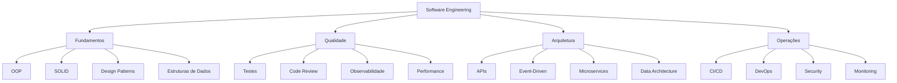

# Learn with me: Software Engineering para Profissionais de Dados

> *"As you become a better data engineer, you'll find yourself naturally adopting more software engineering practices"*  
> — Joe Reis, Fundamentals of Data Engineering

---

## 🎯 Público-Alvo

- **Engenheiros de Dados** que vêm de análise/BI
- **Profissionais de Business/Analytics** migrando para dados
- **Cientistas de Dados** que querem entender engenharia
- Qualquer profissional de dados **sem background formal em Software Engineering**

---

## 📚 Módulo 0: Por Que Software Engineering Importa? (1h)

### A Mudança de Paradigma

Historicamente, profissionais de dados focavam em:
- **Queries SQL otimizadas**
- **Análises estatísticas**
- **Dashboards e visualizações**
- **Processos batch isolados**

Isso funcionava quando:
- ✅ Dados eram menores e centralizados
- ✅ Análise era o produto final
- ✅ Pipelines eram simples ETLs

### O Novo Contexto (2024-2026)

Com o advento de **AI/ML em produção**, **Data Mesh**, e **Real-time Analytics**, agora precisamos:

1. **Pensar em Produtos, não apenas em Dados**
   - Dados são APIs, serviços, features stores
   - SLAs, disponibilidade, versionamento
   - Consumidores internos e externos

2. **Escala e Complexidade**
   - Pipelines com centenas de transformações
   - Múltiplas fontes heterogêneas
   - Dependências complexas

3. **Manutenibilidade**
   - Código que dura anos, não semanas
   - Times distribuídos colaborando
   - Evolução sem breaking changes

4. **AI torna Executores Obsoletos**
   - Ferramentas low-code democratizam análise básica
   - **Engenheiros** que entendem arquitetura agregam valor estratégico
   - Pensamento crítico > execução mecânica

### O que é Software Engineering?

**Software Engineering** não é só programar - é sobre:

```
┌─────────────────────────────────────────────────┐
│  Construir sistemas confiáveis, escaláveis      │
│  e manuteníveis através de princípios,          │
│  padrões e boas práticas de engenharia          │
└─────────────────────────────────────────────────┘
```

**As "Caixinhas" de Software Engineering:**



### Por Que Este Curso?

**❌ Não cabe tudo em um curso**  
Software Engineering é um campo vasto - impossível cobrir tudo

**✅ Uma jornada de aprendizado juntos**  
Este curso nasceu dos tópicos que **eu mesmo** sentia falta ao trabalhar com dados:
- Conceitos que eu queria ter aprendido antes
- Lacunas que percebi ao enfrentar problemas reais
- Fundamentos que me fizeram ser um profissional mais completo

A ideia é **aprender juntos** - não como especialista ensinando, mas compartilhando uma jornada de crescimento.

### O Que Vamos Aprender (Overview)

| Módulo | Tema | Por Que Importa |
|--------|------|-----------------|
| 1 | Fundamentos da Web | Entender como sistemas se comunicam |
| 2 | Python e Computadores | Debugar problemas de performance/memória |
| 3-4 | OOP | Organizar código complexo de pipelines |
| 5 | APIs | Expor dados como serviços |
| 6 | SOLID | Evitar código frágil e difícil de mudar |
| 7 | Design Patterns | Resolver problemas comuns com soluções testadas |
| 8 | Arquitetura | Ver o sistema completo, não só dados |

### Conhecimento Proximal

Ao longo do curso, **todo conceito será conectado a problemas reais de dados**:
- Classes → Conectores de dados reutilizáveis
- SOLID → Pipelines testáveis e extensíveis
- APIs → Feature stores, data catalogs
- Patterns → Orquestradores, transformadores configuráveis

---

## 📖 Estrutura do Curso

### Módulo 1: Fundamentos da Web (2h)

**Objetivos**:
- Entender como internet funciona (HTTP, DNS)
- Compreender o ciclo request/response
- Aplicar em contexto de dados

**Tópicos**:
- Redes e protocolos (TCP/IP, HTTP)
- HTTP methods (GET, POST)
- DNS e domain names
- Status codes e headers
- Request/response na prática

**Entregável**: Script Python usando `requests` para extrair dados de API pública

**Conexão com Dados**:
- Ingestão via APIs REST
- Webhooks para CDC
- Logs de aplicações web

---

### Módulo 2: Python e Computadores (2h)

**Objetivos**:
- Entender como Python se relaciona com o SO
- Diferençar Python de linguagens compiladas
- Debugar problemas de memória

**Tópicos**:
- Interpretado vs compilado
- Stack vs Heap (básico)
- Garbage collection
- Por que Spark usa JVM

**Entregável**: Identificar e corrigir memory leak em script de dados

**Conexão com Dados**:
- Por que Pandas consome RAM
- Polars vs Pandas
- Quando usar Spark vs Pandas
- Otimizar transformações

---

### Módulo 3: OOP - Fundamentos (2h)

**Objetivos**:
- Entender os 4 pilares de OOP
- Criar classes e objetos
- Aplicar herança básica

**Tópicos**:
- Classes, objetos, atributos, métodos
- **Encapsulation**: Ocultar estado interno (privado vs público)
- **Inheritance**: Reutilizar código
- **Polymorphism**: Mesma interface, comportamentos diferentes
- **Abstraction**: Contratos (breve introdução)

**Entregável**: Criar hierarquia `DataSource` → `CSVSource`, `ParquetSource`

**Conexão com Dados**:
- Conectores reutilizáveis
- Transformadores intercambiáveis
- Validadores de schema

---

### Módulo 4: OOP em Dados (2h)

**Objetivos**:
- Refatorar código procedural para OOP
- Reconhecer quando usar OOP
- Aplicar padrões básicos (ETL)

**Tópicos**:
- Padrão **Connector**: Isolar acesso a dados
- Padrão **Transformer**: Organizar transformações
- Padrão **Loader**: Abstrair destinos
- Quando **não** usar OOP

**Entregável**: Refatorar script ETL para classes organizadas

**Conexão com Dados**:
- Pipelines Airflow com classes
- Spark + OOP para lógica de negócio
- Testes unitários

---

### Módulo 5: APIs (2h)

**Objetivos**:
- Entender o que são APIs e seus tipos
- Focar em princípios REST
- Construir API básica com FastAPI
- Expor dados via HTTP

**Contexto - Tipos de APIs**:
Existem vários tipos de APIs (REST, GraphQL, gRPC, SOAP), mas **focamos em REST** porque:
- É o padrão mais comum em data engineering
- Simples de entender e implementar
- Amplamente suportado por ferramentas

**Tópicos**:
- O que são APIs e para que servem
- REST fundamentals (recursos, verbos)
- Rotas e parâmetros (path, query)
- Request/response bodies (JSON)
- Status codes práticos

**Entregável**: API para consultar status de jobs (`GET /jobs/{id}`)

**Conexão com Dados**:
- Feature stores (servir features)
- Data catalogs (metadados)
- ML model endpoints

---

### Módulo 6: SOLID Principles (2h)

**Objetivos**:
- Aplicar 2 princípios SOLID essenciais
- Tornar pipelines testáveis
- Reduzir acoplamento

**Tópicos** (foco em SRP e DIP):

1. **Single Responsibility Principle (SRP)**
   - Uma classe, uma responsabilidade
   - Separar validação de transformação

2. **Dependency Inversion Principle (DIP)**
   - Depender de abstrações
   - Dependency Injection básico

**Entregável**: Aplicar SRP e DIP no código do Módulo 4

**Conexão com Dados**:
- Classes testáveis sem Spark
- Trocar fontes via injeção
- Pipelines configuráveis

---

### Módulo 7: Design Patterns Essenciais (2h)

**Objetivos**:
- Implementar 3 patterns fundamentais
- Resolver problemas reais de pipelines

**Patterns**:

1. **Factory**: Criar objetos dinamicamente
   - `DataSourceFactory.create("s3")` → `S3Source`

2. **Strategy**: Algoritmos intercambiáveis
   - Estratégias de particionamento

3. **Singleton**: Instância única
   - Spark session, DB pool

**Entregável**: Factory para criar conectores via config

**Conexão com Dados**:
- Pipelines configuráveis (YAML/JSON)
- Trocar algoritmos sem refactor
- Gerenciar recursos caros

---

### Módulo 8: Arquitetura de Aplicações (2h)

**Objetivos**:
- Entender arquitetura completa de sistemas
- Ver onde pipelines de dados se encaixam
- Pensar em fluxo de valor end-to-end

**Tópicos**:
- **Frontend**: Como usuários consomem dados
- **Backend**: Lógica de negócio e APIs
- **Data Layer**: Pipelines, warehouses, lakes
- **ML Layer**: Models, feature stores
- Comunicação entre camadas

**Entregável**: Diagrama de arquitetura de sistema real (e-commerce com ML)

**Conexão com Dados**:
- Pipeline alimenta aplicações
- Entender requisitos de latência
- Data contracts entre camadas

---

## 📊 Carga Horária Total

| Módulo | Horas | Tipo |
|--------|-------|------|
| 0 - Introdução | 1h | Teórico |
| 1 - Fundamentos Web | 2h | Misto |
| 2 - Python Internals | 2h | Misto |
| 3 - OOP Fundamentos | 2h | Hands-on |
| 4 - OOP em Dados | 2h | Hands-on |
| 5 - APIs | 2h | Hands-on |
| 6 - SOLID | 2h | Hands-on |
| 7 - Design Patterns | 2h | Hands-on |
| 8 - Arquitetura | 2h | Teórico |
| **TOTAL** | **17h** | - |

**Formatos possíveis**:
- ⭐ **Ideal**: 2h por semana (9 semanas) - Ritmo confortável com tempo para praticar
- 📅 **Alternativo**: 1h por semana (17 semanas) - Formato mais leve e gradual

---

## 📎 Apêndice: Tópicos Importantes Não Cobertos

> ℹ️ Esses tópicos são **extremamente relevantes** para SE, mas não cabem no escopo inicial.  
> Podem ser oferecidos como **módulos avançados** ou **cursos de especialização**.

### A. Testing & Quality Assurance

**Por que importa**:
- 80% dos bugs em produção vêm de código não testado
- Testes automatizados permitem refatoração segura
- Data quality é crítico para confiança em analytics

**Tópicos**:
- Unit testing (pytest)
- Integration testing
- Mocking external services
- Property-based testing (Hypothesis)
- Data testing (Great Expectations, deequ)
- Test-Driven Development (TDD)

**Aplicação em Dados**:
- Testar transformações Spark sem cluster
- Validar schema evolution
- Regression tests para agregações

---

### B. Observabilidade

**Por que importa**:
- Sistemas distribuídos (Spark) são difíceis de debugar
- Detectar anomalias de dados antes de impactar análises
- SLAs exigem monitoramento proativo

**Tópicos**:
- Structured logging (JSON logs)
- Metrics (Prometheus, StatsD)
- Distributed tracing (OpenTelemetry)
- Alerting strategies
- Data quality monitoring

**Aplicação em Dados**:
- Rastrear tempo de execução de pipelines
- Alertar em volume anômalo de dados
- Debug de Spark stages lentos

---

### C. Event-Driven Architecture

**Por que importa**:
- Arquiteturas modernas são assíncronas e reativas
- Real-time processing é cada vez mais comum
- CDC (Change Data Capture) é padrão para data lakes

**Tópicos**:
- Pub/Sub patterns (Kafka, Google Pub/Sub)
- Event sourcing
- Stream processing (Kafka Streams, Flink)
- Lambda/Kappa architectures
- CQRS (Command Query Responsibility Segregation)

**Aplicação em Dados**:
- Pipelines CDC
- Real-time feature stores
- Event-driven orchestration

---

### D. Concurrency & Parallelism

**Por que importa**:
- Otimizar workloads fora do Spark (APIs, I/O)
- Entender como Spark distribui trabalho
- Python GIL limita threading - precisa estratégias

**Tópicos**:
- Threading vs Multiprocessing vs Async/Await
- GIL (Global Interpreter Lock)
- Concurrent.futures
- Asyncio patterns
- Distributed computing (Ray, Dask)

**Aplicação em Dados**:
- Parallel API calls para ingestão
- Async uploads para cloud storage
- Multi-threaded validation

---

### E. Security

**Por que importa**:
- Dados sensíveis (PII, PCI, HIPAA)
- Compliance e auditoria
- Acesso seguro a recursos (DBs, clouds)

**Tópicos**:
- Secrets management (Vault, AWS Secrets Manager)
- Authentication/Authorization (OAuth2, JWT)
- Encryption at rest/in transit
- Data masking/anonymization
- Secure credential handling

**Aplicação em Dados**:
- Credenciais de DB nunca em código
- Criptografia de dados sensíveis
- Row-level security em warehouses

---

### F. CI/CD & DevOps

**Por que importa**:
- Deploy seguro de pipelines em produção
- Automação reduz erros humanos
- Infrastructure as Code permite versionamento

**Tópicos**:
- Git workflows (GitFlow, trunk-based)
- CI/CD pipelines (GitHub Actions, GitLab CI)
- Infrastructure as Code (Terraform)
- Container orchestration (Kubernetes basics)
- Blue/green deployments

**Aplicação em Dados**:
- Deploy automatizado de jobs Spark
- Testes automáticos em PRs
- Rollback de pipelines com bugs

---

### G. Performance Optimization

**Por que importa**:
- Reduzir custos de compute (Spark é caro)
- Cumprir SLAs de latência
- Escalabilidade sustentável

**Tópicos**:
- Profiling Python code (cProfile)
- Memory optimization
- Caching strategies (Redis, lru_cache)
- Lazy evaluation patterns
- Query optimization (explain plans)

**Aplicação em Dados**:
- Otimizar Spark shuffles
- Cachear DataFrames intermediários
- Partitioning strategies

---

### H. Advanced Design Patterns

**Por que importa**:
- Resolver problemas complexos de forma elegante
- Comunicação técnica (linguagem comum)

**Patterns não cobertos**:
- **Builder**: Construir DataFrames complexos passo a passo
- **Observer**: Event-driven pipelines, data quality alerts
- **Decorator**: Adicionar funcionalidades (logging, metrics, caching)
- **Chain of Responsibility**: Multi-stage validation
- **Template Method**: ETL workflows padronizados

**Aplicação em Dados**:
- Pipeline builders configuráveis
- Pluggable data quality rules
- Transformation wrappers

---

### I. Data Governance & Contracts

**Por que importa**:
- Qualidade e confiança em dados
- Compliance (GDPR, LGPD)
- Colaboração entre times (data mesh)

**Tópicos**:
- Data lineage tracking
- Schema registries (Confluent, AWS Glue)
- Data catalogs (OpenMetadata, DataHub)
- Data contracts
- Data versioning

**Aplicação em Dados**:
- Rastrear origem de métricas
- Prevenir breaking changes em schemas
- Self-service analytics

---

### J. Microservices & Distributed Systems

**Por que importa**:
- Arquiteturas modernas são distribuídas
- Entender trade-offs de sistemas complexos

**Tópicos**:
- Microservices patterns
- Service mesh
- CAP theorem
- Eventual consistency
- Circuit breakers, retries, backpressure

**Aplicação em Dados**:
- Data mesh (data as a product)
- Decentralized data platforms
- Resilient data ingestion

---

## 🎓 Próximos Passos Após o Curso

Após completar este curso, os participantes estarão prontos para:

1. **Aplicar imediatamente**:
   - Refatorar pipelines existentes com OOP
   - Criar APIs para expor dados
   - Aplicar design patterns em código novo

2. **Aprofundar** (cursos avançados):
   - Testing & Quality Engineering
   - Event-Driven Data Architecture
   - Production ML Systems (MLOps)

3. **Explorar**:
   - Certificações relevantes (AWS/GCP/Azure Data)
   - Livros clássicos (Clean Code, Design Patterns)
   - Contribuir para projetos open-source de dados

---

## 📚 Recursos Recomendados

### Livros
- "Fundamentals of Data Engineering" - Joe Reis & Matt Housley
- "Designing Data-Intensive Applications" - Martin Kleppmann
- "Clean Code" - Robert C. Martin
- "Head First Design Patterns" - Freeman et al.

### Documentação
- FastAPI: https://fastapi.tiangolo.com
- pytest: https://docs.pytest.org
- Great Expectations: https://greatexpectations.io

### Comunidades
- Data Engineering Weekly
- r/dataengineering
- dbt Community

---

## ✅ Critérios de Sucesso

Ao final do curso, seremos capazes de:

- [ ] **Entender quando problemas de dados são problemas de engenharia**
  - Reconhecer que performance ruim pode ser design ruim, não só query lenta
  - Identificar quando complexidade de pipeline exige arquitetura, não só scripts maiores

- [ ] **Navegar situações não-corriqueiras** que estão cada vez mais comuns:
  - Pipeline precisa ser configurável por não-técnicos (design patterns)
  - Time de ML quer consumir features via API (REST + versionamento)
  - Código de transformação virou spaguete impossível de testar (OOP + SOLID)
  - Precisa trocar fonte de dados sem refactor total (Dependency Injection)
  - Bug em produção mas não sabe onde procurar (arquitetura + separação de responsabilidades)

- [ ] **Comunicar tecnicamente** com times de engenharia
  - Entender quando engenheiro fala de "endpoints", "acoplamento", "contract"
  - Participar de discussões de arquitetura sem se sentir perdido

- [ ] **Continuar aprendizado autônomo**
  - Saber o que pesquisar quando enfrentar novos problemas
  - Reconhecer padrões em código e documentação técnica

---

**Observação Final**: Este curso é uma **fundação**, não um destino. Software Engineering é uma jornada contínua de aprendizado e prática.
